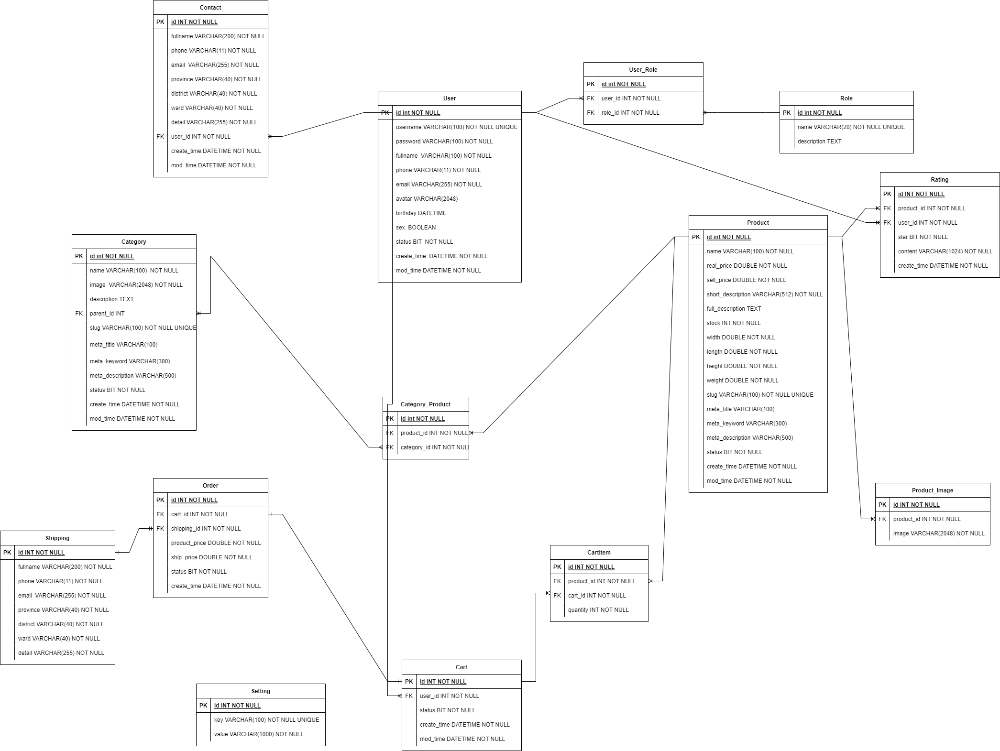
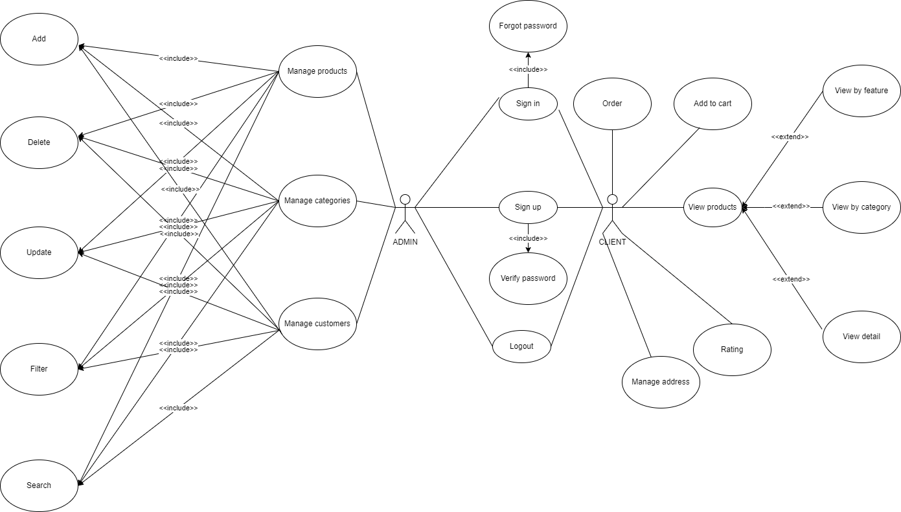

# Nashtech project backend


## Documentation

[Appendix](#appendix)

[Tech](#tech-stack)

[Diagram](#diagram)

[Running Tests](#running-tests)

[Support](#support)


## Appendix

**Frontend:** https://github.com/robocon321/nashtech-project-fe

## Tech Stack


**Server:** Java spring boot, Spring Security, Spring Data JPA

## Diagram

### ERD Diagram



### Usecase Diagram



## Running Tests

To run tests, download this project and run the following command

```bash
  mvn spring-boot:run
```


## Support

For support, email robocon321n@gmail.com or join our Slack channel.

